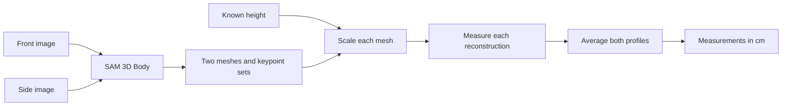

# Body Profile Computation

The profile generator turns front and side photographs plus the person's height into clothing measurements.

## Steps

1. The front and side images are reconstructed concurrently with `fal-ai/sam-3/3d-body`. Each result contains a PLY mesh and named 3D body keypoints. See `FalBodyReconstructor.reconstruct()` in [the reconstruction module](../../src/ropa/reconstruction/body.py).
2. The two meshes are downloaded and loaded with Trimesh. See `BodyProfileGenerator._meshes()` and `load_mesh()` in [the profile module](../../src/ropa/profiles/body.py).
3. Each mesh receives its own centimeter scale by comparing its full extent along the ankle-to-neck body axis with the person's known height. See `body_axis()` and `mesh_scale()` in [the profile module](../../src/ropa/profiles/body.py).
4. Chest, waist, hip, and neck circumferences come from cross-sections through the mesh. The longest connected loop at each level is used so nearby limbs are not included. See `section_circumference()` and `profile_from_reconstruction()` in [the profile module](../../src/ropa/profiles/body.py).
5. Named MHR keypoints provide the linear measurements:

    - Shoulder width: left acromion to right acromion.
    - Sleeve length: acromion to elbow to wrist.
    - Inseam: hip center to knee to ankle.
    - Foot length: heel to the farthest toe point.

6. Left and right limb estimates are averaged within each reconstruction. The front-view and side-view profiles are then averaged into the final result. See `average_bilateral()` and `average_profiles()` in [the profile module](../../src/ropa/profiles/body.py).
7. Every returned value uses centimeters through the `Measurement` model.
